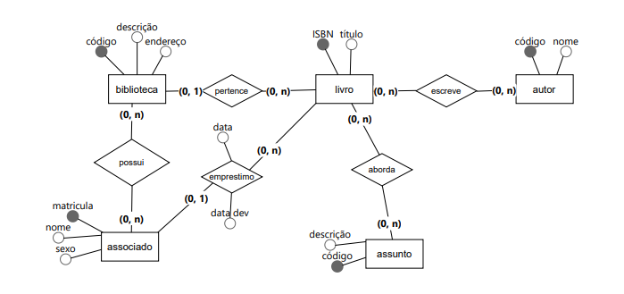

Uma biblioteca pretende controlar empréstimos de livros. Os dados armazenados sobre cada biblioteca são: código, descrição, endereço. Uma biblioteca pode ter vários associados e vários livros cadastrados, uma mesma pessoa pode ser cadastrada em várias bibliotecas. No entanto, cada livro só pode pertencer a uma biblioteca. Empréstimos de livros só são realizados para associados cadastrados. Todo associado deve ter matrícula, nome e sexo. Os livros possuem ISBN e título. Em um dado momento, um livro só pode ser emprestado a um associado, porém um associado pode tomar vários livros emprestados. Um livro pode ser escrito por vários autores e um mesmo autor pode escrever vários livros. Os dados dos autores são: código e nome. Um livro pode abordar vários assuntos e um assunto pode ser abordado por vários livros. Os dados de assuntos são: código e descrição.

