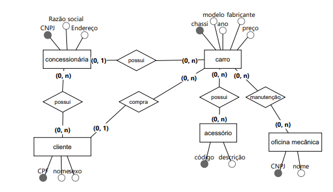

Uma rede de concessionárias de automóveis pretende controlar as vendas de carros. Os dados armazenados sobre cada concessionária são: CNPJ, razão social, endereço. Uma concessionária pode ter vários clientes e vários carros cadastrados, um mesmo cliente pode ser cadastrado em várias concessionárias. No entanto, cada carro só pode pertencer a uma concessionária. As vendas de carros só são realizadas para clientes cadastrados. Todo cliente deve ter CPF, nome e sexo. Os carros possuem chassi, modelo, ano, fabricante e preço. Em um dado momento, um carro só pode ser vendido para um cliente, porém um cliente pode comprar vários carros. Um carro pode ser manutenido por várias oficinas mecânicas e uma mesma oficina mecânica pode manutenir vários carros. Os dados das oficinas mecânicas são: CNPJ e nome. Um carro pode possuir vários acessórios e um acessório pode fazer parte de vários carros. Os dados de acessórios são: código e descrição.

