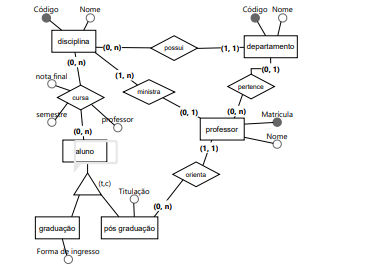

Uma disciplina da UnB possui código e nome e está vinculada a um único departamento que também tem código e nome. Um aluno pode se matricular em várias disciplinas e uma disciplina tem que ter pelo menos um aluno e no máximo um professor. Este aluno pode ser de graduação ou pós-graduação. Para o aluno de pós-graduação é necessário saber sua titulação e para o aluno de graduação a forma de ingresso na UnB. O aluno de pós-graduação está vinculado à apenas um professor/orientador que possui matricula e nome. Este orientador, por sua vez, poderá ter vários orientandos e está vinculado à um único departamento e ministra pelo menos 1 disciplina. Para cada disciplina cursada por um aluno é necessário saber o semestre cursado, nota final obtida e o professor que ministrou.

