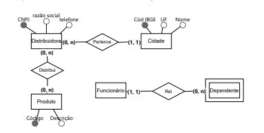

Uma fábrica deseja informatizar seu processo de distribuição de produtos e, para tanto, ela precisa armazenar dados dos distribuidores (CNPJ, Razão Social, Telefone). Como o processo de distribuição é por cidade, precisa-se armazenar as cidades (Código IBGE, UF, Nome) e, evidentemente, as informações dos produtos (Código, Descrição) a serem distribuídos. Para melhor controle interno se faz necessário também guardar as informações dos funcionários (CPF e Nome) e de quem gerencia outros funcionários. É preciso também armazenar os nomes dos dependentes dos funcionários.

